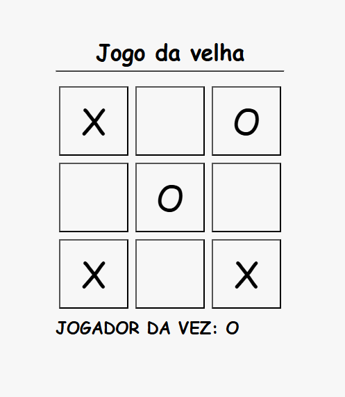

# 🎮 Jogo da Velha (Tic-Tac-Toe)

Um simples e clássico Jogo da Velha desenvolvido com HTML, CSS e JavaScript. Dois jogadores se alternam marcando os espaços em uma grade 3x3 com "X" ou "O". O primeiro que alinhar três símbolos vence!

## 🚀 Funcionalidades

- ✅ Jogo para 2 jogadores (modo local)
- 🔁 Reinício automático após vitória ou empate
- 🧠 Verificação automática de vitória ou empate
- 🎨 Interface simples e responsiva

## 🖼️ Preview

![Jogo da Velha]


## 🛠️ Tecnologias Utilizadas

- HTML5
- CSS3
- JavaScript (ES6)

## 📦 Como Executar

1. Clone o repositório:
   ```bash
   git clone https://github.com/RiaanVictor07/Jogo-da-velha.git
